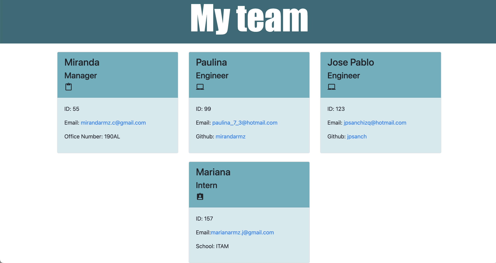

# Team Profile Generator

## The Task

The task consisted in building a Node.js command-line application that takes in information about employees on a software engineering team, then generates an HTML webpage that displays summaries for each person. 
Testing is key to making code maintainable, so it was also necessary to write a unit test and ensure that all tests are passed.

## Technologies found in the application:
* Node.js
* Inquirer
* JTest
* OOP 
* CSS
* HTML
* Javascript

## Walkthrough video

  * Link to walkthrough video: 
  [Walkthrough video](https://drive.google.com/file/d/1RoyTvHlWVhKxa0YCxA6PJKREVKjcQUd-/view?usp=sharing)
  
  The walkthrough video shows both testing and functionality

## Screenshot of demo page
  * Screenshot of demo generated page: 
   

## Solution 
The application is invoked by typing the following command in the command line:

```bash
node index.js
```

